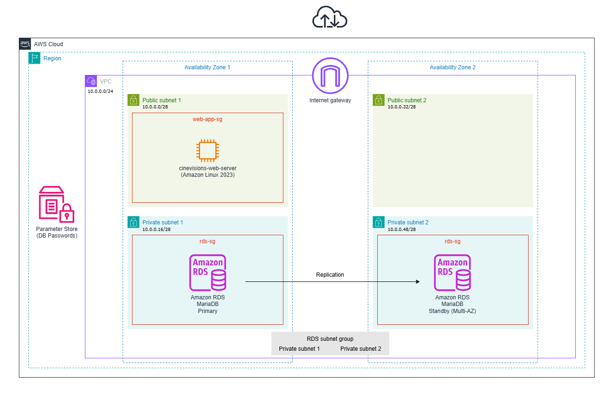

# CineVisions Infrastructure

This Terraform project provisions AWS infrastructure for a WordPress-based web application with automated server configuration.

## Overview

The infrastructure includes:
- VPC with public and private subnets across two availability zones
- EC2 instance running WordPress on Apache
- RDS MariaDB instance in private subnets (Multi-AZ)
- Security groups for HTTP, SSH, and Database access
- Automated WordPress installation and configuration via user data script

## Prerequisites

- [Terraform](https://www.terraform.io/downloads.html) installed
- AWS CLI configured with appropriate credentials
- AWS account with necessary permissions
- Your public IP address for SSH access

## Setup

1. **Configure AWS Credentials**

   Configure your AWS credentials via AWS CLI:
   ```bash
   aws configure [--profile sandbox]
   ```

2. **Create Required SSM Parameters**

   Before deployment, create these AWS Systems Manager Parameter Store values (replace `dev` with your environment if needed):
   ```bash
   aws ssm put-parameter --name "/cinevisions/dev/db/master_password" --value "your-db-root-password" --type "SecureString"
   aws ssm put-parameter --name "/cinevisions/dev/db/wp_password" --value "your-wordpress-db-password" --type "SecureString"
   ```

3. **Configure Variables**

   Create a `terraform.tfvars` file with required variables:
   ```hcl
   aws_profile        = "sandbox"  # only if using a non-default AWS profile
   environment        = "dev"      # or "staging", "prod"
   my_local_public_ip = "YOUR.IP.ADDRESS/32"
   ```

   Optional variables (with defaults):
   - `aws_region`: AWS region (default: us-west-2)
   - `aws_availability_zones`: Map of availability zones (defaults to us-west-2a and us-west-2b)
   - `cinevisions_vpc_cidr`: VPC CIDR block (default: 10.0.0.0/24)
   - `cinevisions_web_server_instance_type`: EC2 instance type (default: t3.micro)
   - Subnet CIDR blocks (see `variables.tf` for defaults)

## Deployment

1. **Initialize Terraform**
   ```bash
   terraform init
   ```

2. **Review the Plan**
   ```bash
   terraform plan
   ```

3. **Apply the Configuration**
   ```bash
   terraform apply
   ```

4. **Access WordPress**

   After deployment completes, Terraform will output:
   - `webserver_public_ip`: Public IP address of the web server
   - `webserver_public_dns`: Public DNS name of the web server
   - `rds_endpoint`: Endpoint of the MariaDB RDS instance
   - `vpc_id`: ID of the created VPC

   Navigate to `http://<webserver_public_ip>` to complete WordPress setup.

## Architecture



- **Network**: Multi-AZ VPC with public and private subnets
- **Compute**: Single EC2 instance in public subnet with automated configuration
- **Database**: Managed MariaDB 11.8 RDS instance in private subnets (Multi-AZ)
- **Web Server**: Apache HTTP Server with PHP 8.5
- **CMS**: WordPress (latest version)

## Security

- SSH access restricted to `my_local_public_ip`
- HTTP (port 80) open to the internet
- RDS database access restricted to the web server security group
- Database credentials stored in AWS Systems Manager Parameter Store
- WordPress config file permissions set to 440

## Cleanup

To destroy all resources:
```bash
terraform destroy
```

## File Structure

- `providers.tf`: AWS provider configuration
- `variables.tf`: Input variable definitions
- `network.tf`: VPC, subnets, and networking resources
- `security.tf`: Security groups (Web, SSH, RDS)
- `compute.tf`: EC2 instances and related resources
- `database.tf`: RDS instance and subnet group
- `outputs.tf`: Output definitions
- `configure-webserver.sh`: User data script for WordPress installation
