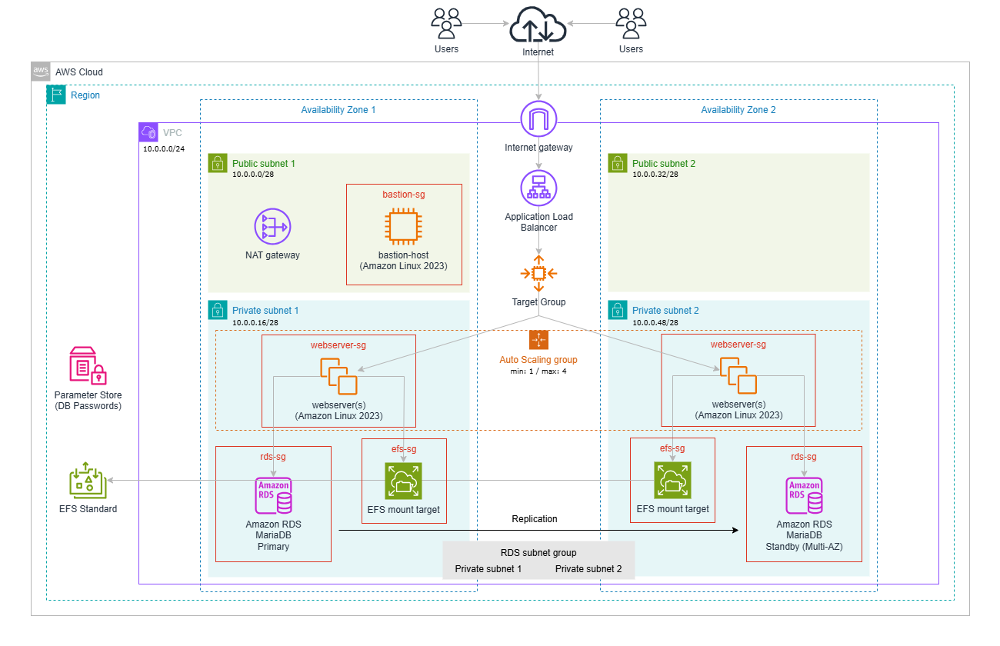

# Film Festival Infrastructure

This Terraform project provisions a highly available AWS infrastructure for a WordPress-based web application with automated server configuration.

## Overview

The infrastructure includes:
- VPC with public and private subnets across two Availability Zones
- Application Load Balancer (ALB) for load distribution
- Auto Scaling Group with Launch Template for WordPress web servers
- Elastic File System (EFS) for shared WordPress content
- RDS MariaDB 11.8 instance in private subnets (Multi-AZ)
- NAT Gateway for outbound internet traffic from private subnets
- Bastion Host (Jump Server) for secure SSH access
- Security Groups for ALB, web servers, Bastion, RDS, and EFS
- Automated WordPress installation and configuration via user data script

## Prerequisites

- [Terraform](https://www.terraform.io/downloads.html) >= 1.2 installed
- AWS CLI configured with appropriate credentials
- AWS account with necessary permissions
- Your public IP address for SSH access to the Bastion Host

## Setup

1. **Configure AWS Credentials**

   Configure your AWS credentials via AWS CLI:
   ```bash
   aws configure [--profile my_profile]
   ```

2. **Create Required SSM Parameters**

   Use the provided script to set database credentials:
   ```bash
   bash scripts/set-db-credentials.sh
   ```

   Or manually create these AWS Systems Manager Parameter Store values:
   ```bash
   aws ssm put-parameter --name "/<project_name>/<environment>/db/master_password" --value "your-db-root-password" --type "SecureString" [--profile my_profile]
   aws ssm put-parameter --name "/<project_name>/<environment>/db/wp_password" --value "your-wordpress-db-password" --type "SecureString" [--profile my_profile]
   ```

3. **Configure Variables**

   Create a `terraform.tfvars` file with required variables:
   ```hcl
   project_name                   = "cinevisions"
   environment                    = "dev"      # or "staging", "prod"
   aws_profile                    = "my_profile"  # optional, only if using a non-default AWS profile
   my_local_public_ip             = "YOUR.IP.ADDRESS/32"
   iam_instance_profile_webserver = "LabInstanceProfile"
   key_name                       = "vockey"
   ```

   Optional variables (with defaults):
   - `aws_region`: AWS region (default: us-west-2)
   - `aws_availability_zones`: Map of Availability Zones (defaults to us-west-2a and us-west-2b)
   - `vpc_cidr`: VPC CIDR block (default: 10.0.0.0/24)
   - `webserver_instance_type`: EC2 instance type (default: t3.micro)
   - Subnet CIDR blocks (see `variables.tf` for defaults)

## Deployment

1. **Initialize Terraform**
   ```bash
   terraform init
   ```

2. **Review the Plan**
   ```bash
   terraform plan
   ```

3. **Apply the Configuration**
   ```bash
   terraform apply
   ```

4. **Access WordPress**

   After deployment completes, Terraform will output:
   - `alb_public_dns`: Public DNS name of the Application Load Balancer
   - `bastion_host_public_ip`: Public IP address of the Bastion Host

   Navigate to `http://<alb_public_dns>` to complete WordPress setup.

## Architecture



- **Network**: Multi-AZ VPC with public and private subnets across two Availability Zones
- **Load Balancing**: Application Load Balancer in public subnets for traffic distribution
- **Compute**: Auto Scaling Group (1-4 instances) with Amazon Linux 2023 in private subnets
- **Bastion Host**: EC2 instance (t3.micro) in public subnet for secure SSH access
- **Storage**: Elastic File System (EFS) with encryption for shared WordPress content across all instances
- **Database**: Managed MariaDB 11.8 RDS instance in private subnets (Multi-AZ, encrypted storage)
- **NAT Gateway**: Enables outbound internet traffic from private subnets
- **Web Server**: Apache HTTP Server with PHP 8.5
- **CMS**: WordPress (latest version)
- **Monitoring**: CloudWatch logs enabled for RDS (error, general, slowquery)

## Security

- SSH access to Bastion Host restricted to `my_local_public_ip`
- Web servers in private subnets without direct internet access
- HTTP (port 80) accessible via ALB to the public
- Web server access only allowed from ALB Security Group
- ALB egress restricted to web server Security Group (HTTP only)
- SSH access to web servers only possible via Bastion Host
- RDS database access restricted to web server Security Group
- EFS access restricted to web server Security Group (port 2049)
- Database credentials stored in AWS Systems Manager Parameter Store (SecureString)
- WordPress config file permissions set to 440
- RDS storage encryption enabled
- EFS encryption enabled
- SSL/TLS connection to RDS enforced (MYSQLI_CLIENT_SSL)
- Deletion protection enabled for production environment
- Automated backups (10 days retention for prod, 1 day for dev/staging)
- Health checks via ALB with ELB-based Auto Scaling health check
- Distributed lock mechanism prevents race conditions during WordPress installation

## Cleanup

To destroy all resources:
```bash
terraform destroy
```

**Note**: For production environments, RDS deletion protection is enabled and must be manually disabled before destroy.

## File Structure

- `terraform.tf`: Terraform and provider version requirements
- `providers.tf`: AWS provider configuration with default tags
- `variables.tf`: Input variable definitions with validation
- `locals.tf`: Local values for resource naming
- `data.tf`: Data sources for AMI and IAM instance profile
- `network.tf`: VPC, subnets, Internet Gateway, NAT Gateway, and route tables
- `security.tf`: Security groups (ALB, web server, Bastion, RDS, EFS)
- `alb.tf`: Application Load Balancer, target group, and listener
- `autoscaling.tf`: Launch template and Auto Scaling Group
- `efs.tf`: Elastic File System and mount targets
- `compute.tf`: Bastion Host EC2 instance
- `database.tf`: RDS MariaDB instance, subnet group, and SSM parameter data sources
- `random.tf`: Random ID generation for RDS final snapshot
- `outputs.tf`: Output definitions
- `configure-webserver.sh.tftpl`: User data script template for WordPress installation
- `scripts/set-db-credentials.sh`: Helper script to set SSM parameters
- `moved.tf`: Resource move operations (if applicable)

## SSH Access to Web Servers

Since web servers are in private subnets, SSH access is via the Bastion Host using ProxyJump:

```bash
# Add your SSH key to the agent
ssh-add /path/to/key.pem

# SSH directly to web server via Bastion Host (ProxyJump)
ssh -J ec2-user@<bastion_host_public_ip> ec2-user@<webserver_private_ip>
```

## Auto Scaling

The Auto Scaling Group is configured with:
- **Min Size**: 1 instance
- **Max Size**: 4 instances
- **Health Check Type**: ELB (via ALB target group)
- **Health Check Grace Period**: 300 seconds
- **Instance Refresh Strategy**: Rolling with 50% min healthy percentage

Web servers are automatically registered with the ALB target group and receive traffic once they pass health checks.
